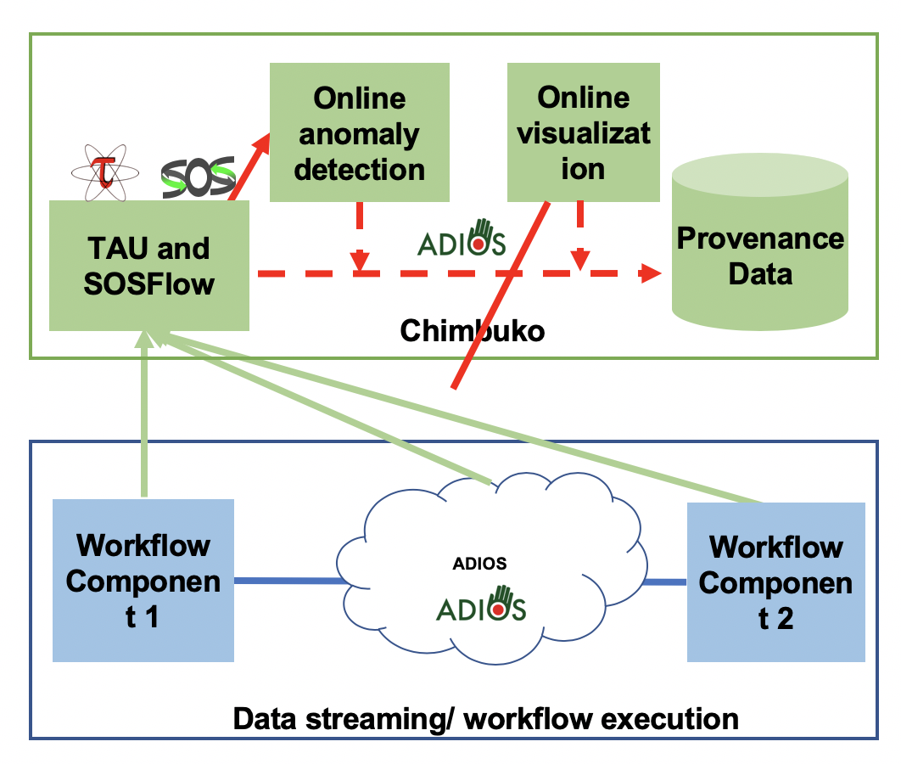

# Chimbuko

Introduction
-------------
The Chimbuko framework captures, analyzes and visualizes performance metrics for complex scientific workflows and relates these metrics to the context of their execution on extreme-scale
machines. The purpose of Chimbuko is to enable empirical studies of performance analysis for
a software or a workflow during a development phase or in different computational environments.
Chimbuko enables the comparison of different runs at high and low levels of metric granularity.
Chimbuko provides this capability in both offline and online (in-situ) modes. Because capturing
performance metrics can quickly escalate in volume and provenance can be highly verbose,
Chimbuko plans to include a data reduction module. The framework is intended to be used first in offline
mode so that a user can determine what metrics are of interest to their case, and then in online mode. 

The following figure shows the basic layout of the Chimbuko framework. 

* The [ADIOS framework ](https://www.olcf.ornl.gov/center-projects/adios/) orchestrates workflow (blue line) and provides data streaming. 
* The [TAU tool](https://www.cs.uoregon.edu/research/tau/home.php) provides performance metrics for instrumented components 1 and 2. The tool extracts provenance metadata and trace data (green lines). 
* [SOSFlow ](https://github.com/cdwdirect/sos_flowstores) and aggregates the data at each node. 
* Trace data is dynamically analyzed to detect anomalies (solid red lines)
* Selected metadata and trace data is stored ( e.g. time window for which trace event interesting) (dashed red lines)

For more information about the design and working philosophy of Chimbuko, please see the [documents directory](https://github.com/CODARcode/Chimbuko/tree/master/documents) . 

The release Chimbuko-v1.0 is for offline mode. Please see the [version_1 directory](https://github.com/CODARcode/Chimbuko/tree/master/version_1) for more information.

The installation includes performance feature extraction package, performance visualization package, and data analysis package. These packages are included in the release as submodules. The installation script will install the dependencies for the main components. 

[SC18 Demo](https://drive.google.com/file/d/1b9iSGWv5xWBA060BjGF5Dom3WZxdShJS/view)
-----------

NWCHEM Usecase
---------------
The detail about the implementation can be found on the following links:
* https://github.com/hjjvandam/nwchem-1/tree/pretauadio/contrib/codar_integration
* https://github.com/hjjvandam/nwchem-1/tree/pretauadio2

[Chimbuko Data Analysis](https://github.com/CODARcode/PerformanceAnalysis)
-------------------------

This library provides a Python API to process [TAU](http://tau.uoregon.edu) performance profile and traces. Its modules support the following functionalities:

  - Parser: processes a given TAU trace (both streaming and batch through Adios).
  - Event: keeps track of event information such as function call stack and function execution times.
  - Outlier: detects outliers in performance of functions.
  - Visualizer: provides an interface to Chimbuko's visualization [software](https://github.com/CODARcode/ChimbukoVisualization) (both online and offline through requests API).

[Chimbuko Visualization](https://github.com/CODARcode/ChimbukoVisualization)
-------------------------

This is a visualization framework for online performance analysis. This framework mainly focuses on visualizing real-time anomalous behaviors in a High Performance Computing application so that any patterns of anomalies that users might not have recognized can be effectively detected through online visual analytics.

