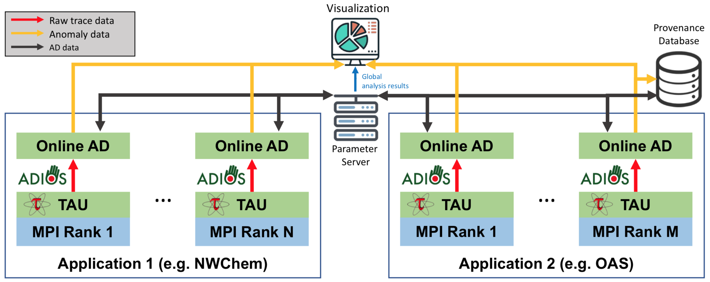

# Chimbuko

## Introduction

The Chimbuko framework captures, analyzes and visualizes performance metrics for complex scientific workflows and relates these metrics to the context of their execution (provenance) on extreme-scale
machines. The purpose of Chimbuko is to enable empirical studies of performance analysis for a software or a workflow during a development phase or in different computational environments.

Chimbuko enables the comparison of different runs at high and low levels of metric granularity by capturing and displaying aggregate statistics such as function profiles and counter averages, as well as maintaining detailed trace information. Because trace data can quickly escalate in volume for applications running on multi-node machines, the core of Chimbuko is an in-situ data reduction component that captures trace data from a running application instance (e.g. MPI rank) and applies machine learning to filter out anomalous function executions. By focusing primarily on performance anomalies, a significant reduction in data volume is achieved while maintaining detailed information regarding those events that impact the application performance. 

Alongside providing a framework to allow for offline analysis of the data collected over the run, Chimbuko also provides an online visualization tool with which aggregated statistics and individual anomalous executions can be monitored in real-time.

The following figure shows the basic layout of the Chimbuko framework. 

* The [ADIOS framework ](https://www.olcf.ornl.gov/center-projects/adios/) orchestrates workflow and provides data streaming. 
* The [TAU tool](https://www.cs.uoregon.edu/research/tau/home.php) provides performance metrics for instrumented components 1 and 2. The tool extracts provenance metadata and trace data. 
* Trace data is dynamically analyzed to detect anomalies by the Online AD modules, and aggregate statistics are maintained on the parameter server.
* Detailed provenance information regarding the detected anomalies is stored in the provenance database, an [UnQLite](https://unqlite.org/) JSON document-store remote database provided by the [Mochi Sonata](https://xgitlab.cels.anl.gov/sds/sonata) framework.
* The visualization module allows for interaction with Chimbuko in real-time.

For more information about the design and working philosophy of Chimbuko, please see the [documents directory](https://github.com/CODARcode/Chimbuko/tree/master/documents). 

## Documentation

Detailed documentation on the API, installation and usage of the Chimbuko "PerformanceAnalysis" backend can be found [here](https://chimbuko-performance-analysis.readthedocs.io/en/latest/), and documentation on the visualization module can be found [here](https://github.com/CODARcode/ChimbukoVisualizationII).

## Releases

The current v5.0 release includes support for installation via Spack, a new script to simplify launching the Chimbuko services, a streaming implementation of the HBOS algorithm for improved anomaly detection, and various optimizations.

### [Chimbuko Data Analysis](https://github.com/CODARcode/PerformanceAnalysis)

This library provides C/C++ APIs to process [TAU](http://tau.uoregon.edu) performance profile and traces.

### [Chimbuko Visualization](https://github.com/CODARcode/ChimbukoVisualizationII)

This is a visualization framework for online performance analysis. This framework mainly focuses on visualizing real-time anomalous behaviors in a High Performance Computing application so that any patterns of anomalies that users might not have recognized can be effectively detected through online visual analytics.

