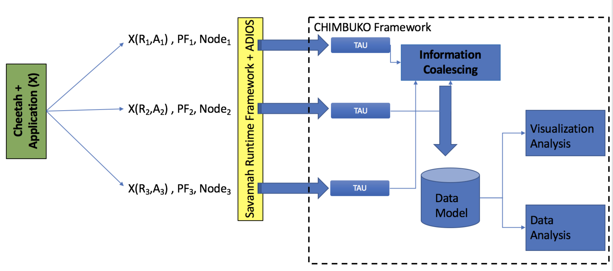

# Chimbuko-0.1-Release-Dec.-2017

Introduction
-------------
The Chimbuko framework captures, analyzes and visualizes performance metrics (see design documents in the documents directory) in the for complex scientific workflows and relates these metrics to the context of their execution on extreme-scale
machines. The purpose of Chimbuko is to enable empirical studies of performance analysis for
a software or a workflow during a development phase or in different computational environments.
Chimbuko enables the comparison of different runs at high and low levels of metric granularity.
Chimbuko aims at providing this capability in both offline and online (in-situ) modes. Because capturing
performance metrics can quickly escalate in volume and provenance can be highly verbose,
Chimbuko plans to include a data reduction module. The framework is intended to be used first in offline
mode so that a user can determine what metrics are of interest to their case, and then in online mode. 

The following figure shows the basic layout of the Chimbuko framework.

For more information about the design and working philosophy of Chimbuko, please refer to the documents in the directory https://github.com/CODARcode/Chimbuko-0.1-Release-Dec.-2017-/tree/master/documents .

What is Chimbuko-0.1?
---------------------
The Chimbuko-0.1 release is for offline mode. The installation includes performance feature extraction package, performance visualization package, and data analysis package. These packages are included in the release as submodules. The installation script will install the dependencies for the main components. 

Software Dependencies
---------------------
The following  tools are needed for Chimbuko.

### TAU ####
If your application is using ADIOS, you need to build TAU with ADIOS.

* Build ADIOS 1.12 as usual (source available at https://github.com/ornladios/ADIOS)

* Configure and build TAU 2.26.2 (or highier) as usual. Add the flag -adios=/path/to/adios/installation at the configure step (source available at http://tau.uoregon.edu/tau.tgz) if you want to capture the adios events through TAU.

* Add /path/to/tau/$arch/bin to your PATH/path environment variable (where “/path/to/tau” is your TAU installation location)

* Set the TAU_MAKEFILE to the Makefile that matches your TAU configuration, located in /path/to/tau/$arch/lib/Makefile.tau-*

### MongoDB ###
* You need to install MongoDB (https://docs.mongodb.com/v3.4/installation) on your machine for the visualization component.

### Nodejs ###
* You need to install Node.js (https://github.com/nodejs/help/wiki/Installation ) for the visualization component.

Installation
-------------

Preprocessing of TAU Data
-------------------------

Performance Feature Extraction
------------------------------

The TAU framework is used for feature extraction. Currently, TAU can be used for one application. However, scientifc workflows consist of more than one applications. These applications interact with each others. In order to analyize the performance behavior of scientific workflows, TAU framework's scripts were modified based on the BNL visualization and data anlysis teams' needs and feedback. This includes coalesing different TAU profiling and tracing data, converting performance data to JASON format, and extracting performance summary for each component in a workflow.

Chimbuko's `feature_extraction2json.py` is a python script that takes profile data for each component in a scientifc workflow and summarizes basic information at the workflow level and at the component level. The script is publically available in CODAR's git https://github.com/CODARcode/Chimbuko-feature-extraction. 

Performance Visualization
-------------------------

The visualization framework of Chimbuko is based on the TAU instrumentation which collects traces and profiles for workflow executions. This framework provides the visualization of these input which helps a user to understand the overall performance. The source code of visualization part is publically available in CODAR's git https://github.com/CODARcode/PerformanceVisualization

Data Analysis
-------------
Shinjae's stuff

LAMMPS Example
---------------
The LAMMPS workflow example is avaiable at https://github.com/CODARcode/Example-LAMMPS.
Cheetah is used to generate scripts for automatically harness of experiments. The obtained profile and trace data could be  analyzed and visualized using Chimbuko. Example-LAMMPS.pdf, in the documents directory, gives detail on configuring and running LAMMPS using TAU on Titan.

Heat Transfer Example
---------------------
The heat transfer example has been prepared to demonstrate CODAR Savana capability in which users can compose and execute multiple applications in an orchestrated environment. The heat transfer example is publicly available in CoDAR's git repository: https://github.com/CODARcode/Example-Heat_Transfer, or as a tarball associated with the Savanna v0.5 release https://github.com/CODARcode/savanna/releases/tag/v0.5. A short tutorial for running the heat tranfer example with Chimbuko for feature extraction is available at https://github.com/CODARcode/Chimbuko-feature-extraction.

