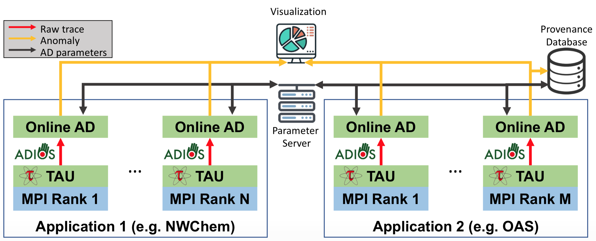

********
Overview
********

Due to the limits I/O systems currently impose on high-performance computing systems, 
a new generation of workflows that include online data reduction and analysis is emerging. 
To diagnose their performance requires sophisticated performance analysis capabilities, 
due to the complexity of execution patterns and underlying hardware. 

To date, no tool could handle the voluminous performance trace data needed to detect 
potential problems. This work introduces **Chimbuko**, a performance analysis framework 
that provides real-time, distributed, *in-situ* anomaly detection. 

   Chimbuko architecture diagram with major components: TAU, online AD modules, visualization,
   provenance database. It illustrates two concurrently running applications. 

**Chimbuko** provides:

- Data volumes reduction for human-level processing without losing necessary details (See :doc:`AD module <./anomaly_detection>`) 
- Online performance monitoring (See :doc:`Viz module <./visualization>`)
- The capture and reduction of performance provenance 

To the best of our knowledge, **Chimbuko** is the first online, distributed, and scalable 
workflow-level performance trace analysis framework, and we demonstrate the tool's usefulness 
on ORNL's Summit system.
