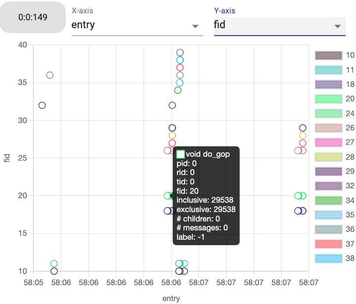

**************************
Visualization (Viz) module
**************************

Backend Server
--------------

.. figure:: img/vizserver.png
   :scale: 20 %
   :align: center
   :alt: Visualization server

   The architecture for visualization backend server 
   including uWSGI workers serving concurrent connections, 
   celery workers and a Redis message queue for asynchronous tasks 
   and a database for data storage. 

The backend server is designed to support

- Huge amounts of concurrent requests as many as the number of *on-node AD modules* currently running
- Streaming workflow-level performance analysis results (from PS) with minimal memory overhead
- Handling long running tasks asynchronously  

For this, the server is designed to have two levels of scaling. At the first level, uWSGI will 
instantiate the web application in its first process and will fork multiple times until the desired 
number of workers is reached. Each of them will be fully instantiated to be ready to serve 
connections. At the second level, especially to handle the long-running tasks (e.g. inserting/querying 
data into/from database) asynchronously, the requests are distributed over pre-forked processes 
(celery workers and Redis message queue) and return response as quickly as possible. Finally, 
streaming (or broadcasting) data to the connected users is done by using Websocket technology 
with socket IO library.  

Frontend visualization
----------------------

The frontend visualization design presents data in different levels of detail by following 
the *Overview first, zoom and filter, then details on-demand* mechanism commonly adopted 
in the visualization domain. 

In-Situ Visualization
~~~~~~~~~~~~~~~~~~~~~

.. figure:: img/anomaly_stat_view.png
   :scale: 70 %
   :align: center
   :alt: in-situ ranking dashboard

   Dynamic **ranking dashboard** as rank-level visualization granularity 
   for the most and the least problematic MPI processes.

Using the data from the Parameter Server (PS), the *in-situ* visualization receives data 
in a streaming fashion and processes that into a number of anomaly statistics. We aim to provide 
a dynamic **ranking dashboard** of the most and least problematic MPI ranks as a *rank-level* 
granularity of the application. The available statistics includes the average, standard deviation, 
maximum, minimum and the total number of anomaly functions. Users can select one of the statistic 
kinds along with the number ranks they want to see. Detailed information is available when 
hovering over each bar chart. 

.. figure:: img/anomaly_history.png
   :align: center
   :alt: in-situ time frame-level granularity

   Streaming view of several series of the numbers of anomalies as 
   *time frame-level* visualization granularity for various ranks.

Selecting (or clicking) bars in the **ranking dashboard** activates the visualization server 
to broadcast the number of anomalies to the connected users in a time frame while performance 
traced applications are running. This **streaming scatter plot** serves as a *time frame-level* 
granularity by showing the number of anomalies of a MPI rank within a time window. 

Here, each dot represents a time frame of a selected rank. Color encoding is applied to 
differentiate different ranks. Hovering over a dot will pop up a window showing detailed 
information including the number of detected anomalies, time frame id, and the analyzed time range. 
Clicking one dot triggers the online analysis visualization that is explained in the following 
subsection.

Online Analysis Visualization
~~~~~~~~~~~~~~~~~~~~~~~~~~~~~

The online analysis visualization is designed to retrieve data from database and to present 
the *finest level* of granularity into the function execution details. 
It consists of two parts: a **function view** and a **call stack view**. 

   The function execution visualization for a selected time frame (ID 149) and Rank ID 0 
   for Application 0 in a "entry" vs. "fid" layout.

In the **function view**, it visualizes distribution of executed functions within a selected time 
interval. The distribution can be controlled by selecting X- and Y-axis among function ID, 
entry and exit time, inclusive and exclusive run time, label indicating if anomaly or not, 
the number of children functions, and the number of communication (messages). Hovering a circle 
will show all available information. Clicking a circle (or a function) will trigger 
a call stack view that includes the selected function.

.. figure:: img/call_stack_view.png
   :align: center
   :alt: online function view

   The call stack visualization for the selected function "MD_NEWTON".

In the **call stack view**, users can more closely investigate the relationships among functions 
and communications over ranks. For example, in the above figure, it shows zoomed-in 
call stack view within the time range refined by an user. Anomaly labels are encoded by the color 
of the name of each function with black being normal and red being abnormal. Hovering over 
a horizontal bar in the call stack will pop up detailed information regarding the corresponding 
function. A communication (message receiving or sending) is encoded by an arrow between a function 
and a horizontal line representing another rank ID. 

Furthermore
-----------

More details can be found in `visualization repository <https://github.com/CODARcode/ChimbukoVisualizationII>`_.
